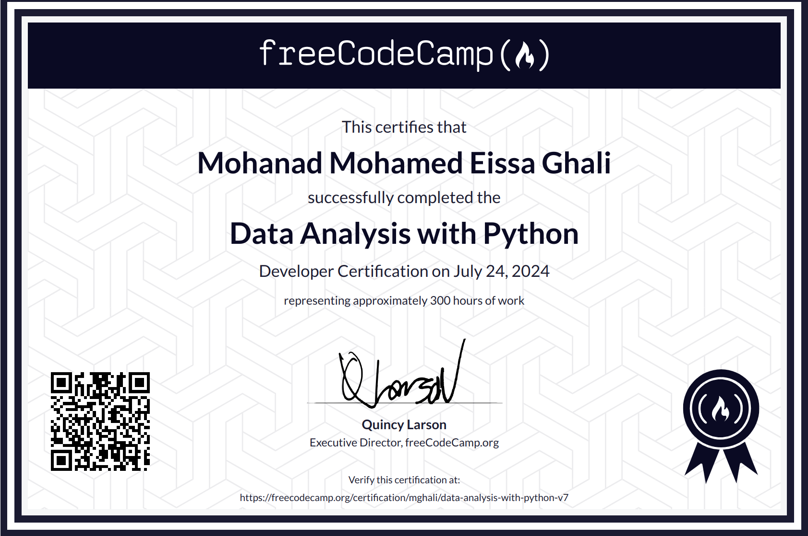

# Data Analysis with Python

My Solutions to the Data Analysis with Python Certification projects.

- [Mean-Variance-Standard Deviation Calculator](./mean-variance-standard-deviation-calculator/)
- [Demographic Data Analyzer](./demographic-data-analyzer/)
- [Medical Data Visualizer](./medical-data-visualizer/)
- [Page View Time Series Visualizer](./page-view-time-series-visualizer/)
- [Sea Level Predictor](./sea-level-predictor/)

 

&nbsp;&nbsp;[freeCodeCamp](https://www.freecodecamp.org/certification/mjcs-95/data-analysis-with-python-v7)
